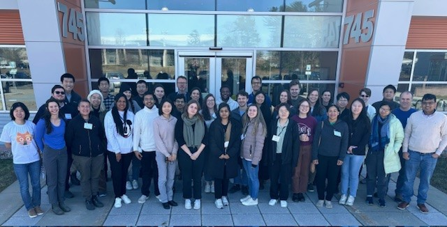

March 19-21, 2024
=================

|nbsp|

.. admonition:: TL;DR

   Download all slide decks and other course materials:
   :download:`March2024.zip <_static/March2024.zip>`

X-ray absorption spectroscopy is a core technique of the DOE
synchrotron user facilities and attracts diverse scientific
communities. This 3-day course offered by NSLS-II experts introduced
XAS data analysis to new and prospective users and provided an
opportunity to participate in measurements at NSLS-II XAS
beamlines. The first two days were devoted to the fundamentals of XAS
analysis, data reduction and processing, and the basics of XAS
experiments and instrumentation.

Participants were trained on XAS data analysis of increasing
complexity.  Modern XAS methods such as high-resolution spectroscopy
were be introduced. On the third day, the participants participated in
experiments at the three XAS beamlines.

`Course page at NSLS-II <https://www.bnl.gov/xascourse/>`__

This course was organized and presented by Lu Ma, Bruce Ravel, and Eli
Stavitski with additional lectures by Denis Leshchev and Akhil Tayal
and help from Dali Yang.  Kerri Banaszek provided logistical support.

.. _fig-groupphoto2024:

   The participants and instructors of the March 2024 XAS Workshop

Tuesday, March 19
-------------------

:Welcome:

   A greeting from the NSLS-II interim director and an overview of the
   scientific mission of the light source

   + Presenter: `Erik Johnson <https://www.bnl.gov/staff/johnson>`__
   + Slide deck: :download:`BNL NSLS-II XAS 19 MAR 2024.pdf <_static/March2024/BNL NSLS-II XAS 19 MAR 2024.pdf>`

   | 

:Introduction to XAS:

   Overview of the basic physics and chemistry of XAS

   + Presenter: `Bruce Ravel <https://www.bnl.gov/staff/bravel>`__
   + Slide deck: :download:`XAFS2024_Intro.pdf <_static/March2024/XAFS2024_Intro.pdf>`

   | 

:Data reduction and background removal:

   An introduction to processing XAS data, including background
   subtraction and Fourier transforms

   + Presenter: `Akhil Tayal <https://www.bnl.gov/staff/atayal>`__
   + Slide deck: :download:`XAFS_Normalization_2024.pdf <_static/March2024/XAFS_Normalization_2024.pdf>`

   | 

:EXAFS analysis I:

   An introductory EXAFS data analysis problem using FeS\
   :sub:`2`. This is the introduction to fitting EXAFS data analysis
   with Feff and Artemis

   + Presenter: `Bruce Ravel <https://www.bnl.gov/staff/bravel>`__
   + |mu|\ (E) data: :download:`FeS2_RT.xmu <_static/March2024/FeS2/FeS2_RT.xmu>`
   + crystal data: :download:`FeS2.inp <_static/March2024/FeS2/FeS2.inp>`
     (this is a file format that Artemis can inport)
   + final fitting model: :download:`FeS2_final.fpj <_static/March2024/FeS2/FeS2_final.fpj>`
   + discussion of FeS\ :sub:`2` final fit: :download:`fes2.pdf <_static/March2024/fes2.pdf>`

   | 

:XANES analysis:

   An introduction to methods and challenges of XANES analysis.

   + Presenter: `Denis Leshchev <https://www.bnl.gov/staff/dleshchev>`__
   + Slide deck: :download:`XANES_analysis_workshop.pdf <_static/March2024/XANES_analysis_workshop.pdf>`

   | 

Wednesday, March 20
---------------------

:Sample preparation and sample environments:

   A discussion of how to plan for your XAS experiment, how to prepare
   your samples for measurement, and how to plan for *in situ* and
   *operando* experiments

   + Presenter: `Eli Stavitski <https://www.bnl.gov/staff/istavitski>`__
   + Slide deck: :download:`Sample_prep_and_sample_environemnts_2024.pdf <_static/March2024/Sample_prep_and_sample_environemnts_2024.pdf>`

   |

:EXAFS analysis II:

   The FeS\ :sub:`2` example from the previous day might seem a bit
   too simple.  It involves analysis of a crystalline material, thus
   the path through the analysis obviously starts with crystal data.
   In these two lectures, some ideas are presented about how to
   perform EXAFS analysis on more complex materials.

   + Presenter: `Bruce Ravel <https://www.bnl.gov/staff/bravel>`__
   + EXAFS and non-crystalline materials: :download:`noxtal.pdf <_static/March2024/noxtal.pdf>`
   + A hard EXAFS problem, Hg bound to nucleotides: :download:`hgdna.pdf <_static/March2024/hgdna.pdf>`

   | 

:High energy resolution techniques:

   High energy resolution fluorescence detection (HERFD), X-ray
   emission spectroscopy (XES), and resonant inelastic X-ray
   spectroscopy (RIXS) using crystal spectrometers.

   + Presenter: `Denis Leshchev <https://www.bnl.gov/staff/dleshchev>`__
   + Slide deck: :download:`High_resolution_techniques_workshop.pdf <_static/March2024/High_resolution_techniques_workshop.pdf>`

   | 

:Combined techniques:

   How to plan for and implement additional measurement techniques
   such as XRD and DRIFTS during your XAS experiment.

   + Presenter: `Lu Ma <https://www.bnl.gov/staff/luma>`__
   + Slide deck: :download:`LM-XAS2024-1.pdf <_static/March2024/LM-XAS2024-1.pdf>`

Thursday, March 21
--------------------

:Experimental session: 

   Hands-on XAS data collection at the NSLS-II hard X-ray spectroscopy beamlines

   + `QAS <https://www.bnl.gov/nsls2/beamlines/beamline.php?r=7-BM>`__
   + `BMM <https://www.bnl.gov/nsls2/beamlines/beamline.php?r=6-BM>`__
   + `ISS <https://www.bnl.gov/nsls2/beamlines/beamline.php?r=8-ID>`__

Data from QAS
~~~~~~~~~~~~~

.. admonition:: Coming soon

   Data from QAS

Data from BMM
~~~~~~~~~~~~~

During the hands-on experiment at BMM in the morning, we measured
several Mn standards along with the mineral `babingtonite
<https://en.wikipedia.org/wiki/Babingtonite>`__ in fluorescence at the
Mn and Fe edges.

In the afternoon, we measured several Zn standards along with the
mineral `petedunnite <http://webmineral.com/data/Petedunnite.shtml>`__
in fluorescence at the Zn and Fe edges.

Zip file containing these data and the full electronic log book:
:download:`BMM data.zip <_static/March2024/BMM.zip>`

ISS exercise: Understanding experimental artifacts
~~~~~~~~~~~~~~~~~~~~~~~~~~~~~~~~~~~~~~~~~~~~~~~~~~

.. admonition:: Coming soon
 
   Presentation by Eli

Links and Resources
-------------------

Here is a zip file with all of the downloads linked above:
:download:`March2024.zip <_static/March2024.zip>`

+ `Tutorials at XrayAbsorption.org <https://xrayabsorption.org/tutorials/>`__
+ `Bruce's XAS Education page <http://bruceravel.github.io/XAS-Education/>`__
